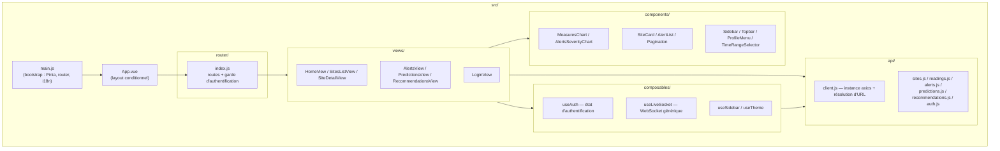

# Architecture du code

## Vue d'ensemble



## Pourquoi cette organisation

- **`api/` isole tous les appels réseau.** Chaque fichier (`sites.js`, `alerts.js`...)
  n'exporte que de fines fonctions (`fetchSites()`, `fetchAlerts(params)`...) qui
  appellent `apiClient` (défini dans `client.js`). Les vues ne connaissent jamais
  d'URL ni de détail axios — si l'API change de forme de réponse, un seul fichier
  bouge.
- **`composables/` porte l'état et la logique réutilisable entre vues**, au sens Vue 3
  du terme (fonctions qui utilisent `ref`/`computed`/hooks de cycle de vie). `useAuth`
  et `useLiveSocket` sont utilisés par plusieurs vues sans dupliquer de logique.
- **`components/` porte l'affichage réutilisable et sans état métier propre** :
  `MeasuresChart` ne sait pas d'où viennent ses données, il reçoit une prop `series`
  déjà prête — voir [05-composants-cles.md](05-composants-cles.md).
- **`views/` orchestre** : une vue va chercher les données (`api/`), gère leur cycle de
  vie (`composables/`), et les passe aux `components/`. C'est la seule couche qui
  connaît à la fois l'API et l'affichage.

## `App.vue` : layout conditionnel selon l'authentification

```vue
<template>
  <div v-if="isAuthenticated" class="layout">
    <Sidebar />
    <div class="main-content">
      <Topbar />
      <div class="main-scroll"><RouterView /></div>
    </div>
  </div>
  <RouterView v-else />
</template>
```

Le choix est simple mais structurant : `Sidebar`/`Topbar` ne sont **jamais montés**
tant que l'utilisateur n'est pas connecté — pas de risque qu'un composant du layout
principal tente d'appeler une route protégée de l'API avant qu'un token n'existe.
`LoginView` s'affiche donc seule, sans chrome autour.

## Suite

- [03-authentification.md](03-authentification.md) — le circuit complet du JWT, de la
  connexion à la garde de route.
