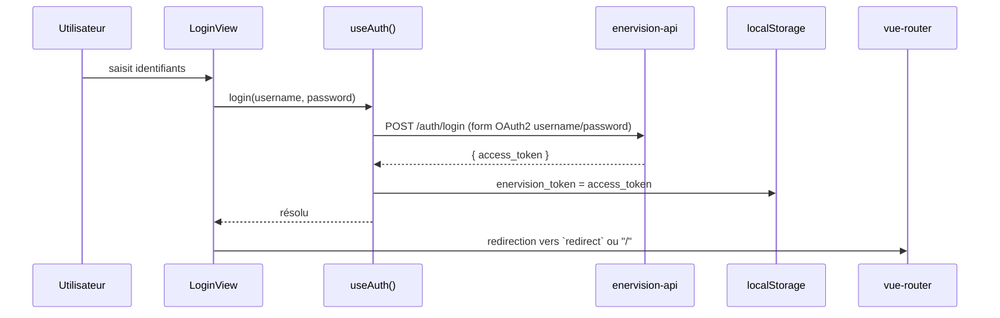

# Authentification

## Le flux complet



## Pourquoi une simple fonction composable, pas un store Pinia

`useAuth.js` :

```js
const TOKEN_KEY = "enervision_token";
const token = ref(localStorage.getItem(TOKEN_KEY));

export function useAuth() {
  const isAuthenticated = computed(() => !!token.value);
  async function login(username, password) { /* ... */ }
  function logout() { /* ... */ }
  return { isAuthenticated, login, logout };
}
```

Pinia est bien installée (`main.js` fait `.use(createPinia())`) mais l'authentification
ne l'utilise pas : l'état à gérer se résume à *un seul jeton, pour un seul compte de
service* (voir [enervision-api/docs/06-securite.md](../../enervision-api/docs/06-securite.md) —
l'API n'a qu'un couple `api_username`/`api_password_hash` configuré, pas de table
utilisateurs). Un store Pinia complet serait de la structure sans bénéfice tant qu'il
n'y a qu'un seul profil possible. `token` est une `ref` déclarée **au niveau du module**
(hors de la fonction `useAuth`) : tous les appels à `useAuth()` partagent donc le même
état, ce qui donne l'effet d'un store sans en écrire un — le jour où plusieurs profils
seraient nécessaires, migrer vers un store Pinia dédié serait la suite logique.

## Où le token est utilisé

Le token ne transite jamais explicitement dans les vues : deux points de contact
suffisent, tous les deux dans `api/client.js`.

1. **Chaque requête REST** : un intercepteur axios ajoute
   `Authorization: Bearer <token>` en le lisant directement dans `localStorage` (pas
   via `useAuth()`, pour rester indépendant de tout contexte Vue — l'intercepteur
   tourne aussi bien dans un composant que dans un utilitaire).
2. **Chaque WebSocket** : `buildWsUrl()` ajoute le token en paramètre de requête
   (`?token=...`). Un WebSocket natif ne permet pas de poser un en-tête
   `Authorization` — c'est une limitation du navigateur, pas un choix du projet — donc
   `enervision-api` (`app/routers/live.py`) accepte le token par ce biais pour les deux
   endpoints temps réel (voir
   [enervision-api/docs/05-temps-reel-websocket.md](../../enervision-api/docs/05-temps-reel-websocket.md)).

## Expiration et déconnexion automatique

```js
apiClient.interceptors.response.use(
  (response) => response,
  (error) => {
    if (error.response?.status === 401) {
      localStorage.removeItem("enervision_token");
      if (window.location.pathname !== "/login") window.location.href = "/login";
    }
    return Promise.reject(error);
  },
);
```

Un `401` (token absent, invalide ou expiré — l'API l'émet après `jwt_expire_minutes`,
voir [enervision-api/docs/07-configuration.md](../../enervision-api/docs/07-configuration.md))
déclenche un nettoyage et une redirection immédiats, **où que la requête ait été faite**
dans l'application : pas besoin que chaque vue gère elle-même ce cas d'erreur.

## La garde de route

```js
router.beforeEach((to) => {
  const { isAuthenticated } = useAuth();
  if (!to.meta.public && !isAuthenticated.value) {
    return { name: "login", query: { redirect: to.fullPath } };
  }
  return true;
});
```

Toutes les routes sont protégées par défaut ; seule `/login` porte
`meta: { public: true }`. La route demandée initialement est conservée en paramètre
`redirect`, pour renvoyer l'utilisateur là où il voulait aller une fois connecté plutôt
que systématiquement à l'accueil.

## Suite

- [04-navigation-et-vues.md](04-navigation-et-vues.md) — les routes et ce que chaque
  vue affiche.
