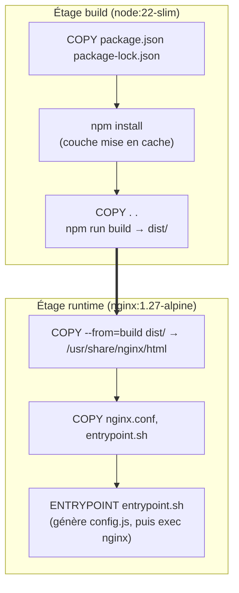

# Déploiement et flux devops

Comme `enervision-api` (voir
[enervision-api/docs/08-deploiement-et-flux-devops.md](../../enervision-api/docs/08-deploiement-et-flux-devops.md)),
`enervision-dashboard` ne sait pas se déployer elle-même : elle construit une image
Docker, la pousse sur le registre, puis délègue tout le mécanisme de déploiement au
dépôt central `enervision-devops`.

## L'image Docker : build Vite, servi par nginx



Même principe que côté API : les dépendances (`npm install`) sont installées **avant**
de copier le reste du code source, pour que cette couche ne soit reconstruite que si
`package.json`/`package-lock.json` changent. L'étage final ne contient ni Node ni le
code source Vue — uniquement les fichiers statiques buildés et nginx : image runtime
minimale, aucune surface d'attaque liée à un outillage de build inutile en production.

## `nginx.conf` : fallback SPA

```nginx
location / {
    try_files $uri $uri/ /index.html;
}
```

`vue-router` est configuré en mode `history` (`createWebHistory()`, pas de `#` dans les
URLs) : une URL comme `/sites/site-042` n'existe pas comme fichier sur le serveur, c'est
`vue-router` côté client qui l'interprète. Sans ce `try_files`, nginx renverrait un 404
nginx brut sur tout rechargement de page (F5) autre que `/` — le fallback renvoie
`index.html` pour toute route inconnue, laissant `vue-router` reprendre la main côté
client.

## `enervision-devops` : même mécanisme centralisé que pour l'API

```mermaid
flowchart LR
    subgraph repoDash["enervision-dashboard (ce dépôt)"]
        Push["git push sur develop/main"] --> CI["CI : lint + tests (vitest)"]
        CI --> Build["build image Docker<br/>(npm run build → nginx)"]
        Build --> Push2["push vers GHCR<br/>ghcr.io/.../enervision-dashboard:SHA"]
    end
    subgraph devops["enervision-devops (dépôt central)"]
        Deploy["deploy.yml (workflow_call)"]
        Compose["compose/dashboard.yml"]
    end
    Push2 --> Call["appelle deploy.yml<br/>service=dashboard, stage=dev|prod, image=...:SHA"]
    Call --> Deploy
    Deploy -- "docker compose -f compose/dashboard.yml up -d" --> Compose
    Compose --> Runner["Runner self-hosted<br/>= le serveur on-premise lui-même"]
```



Le workflow réutilisable (`deploy.yml`, `workflow_call`) et son déroulé pas à pas
(checkout explicite de `enervision-devops`, login GHCR côté runner, écriture du `.env`,
`docker compose -p g4-dashboard-<stage>`) sont **identiques** à ceux documentés pour
l'API — voir cette section pour le détail, il n'est pas dupliqué ici.

## `compose/dashboard.yml`

```yaml
name: g4-dashboard
services:
  dashboard:
    image: ${IMAGE}
    container_name: g4_dashboard_${STAGE}
    restart: unless-stopped
    environment:
      API_URL: ${API_URL}
    networks:
      - g4_net
    ports:
      - "${DASHBOARD_PORT}:80"
networks:
  g4_net:
    external: true
```

Le point de contact direct avec [07-configuration-et-build.md](07-configuration-et-build.md) :
**`API_URL`** est la seule variable métier de ce service. Elle est passée en variable
d'environnement au conteneur, lue par `docker/entrypoint.sh` au démarrage, et écrite dans
`config.js` — c'est cette valeur, définie ici et nulle part ailleurs, qui détermine vers
quelle API le dashboard pointe pour un environnement donné (`onprem-dev` a sa propre
`API_URL`, différente de celle d'`onprem-prod`).

`restart: unless-stopped` : contrairement à `compose/api.yml`, ce service sert du
contenu purement statique — un redémarrage automatique après un crash nginx (rarissime)
ne présente aucun risque de cohérence, pas de connexion base de données à rouvrir
proprement.

`ports: "${DASHBOARD_PORT}:80"` : même logique de suffixage par `STAGE` que pour l'API,
pour que `dev` et `prod` cohabitent sur le même hôte Docker sans collision de port ni de
nom de conteneur (`container_name: g4_dashboard_${STAGE}`).

## Secrets

Contrairement à l'API, `enervision-dashboard` n'a **aucun secret** à proprement parler :
`API_URL` est une adresse, pas un mot de passe ou une clé. Le fichier `ENV_FILE_CONTENTS`
côté GitHub Environments existe malgré tout par cohérence avec les autres services (même
mécanisme de déploiement générique pour tous), même si son contenu est ici trivial.

## Suite

- [09-tests-et-qualite.md](09-tests-et-qualite.md) — l'outillage de test (`vitest`) et ce
  que la CI vérifie avant de construire l'image.
